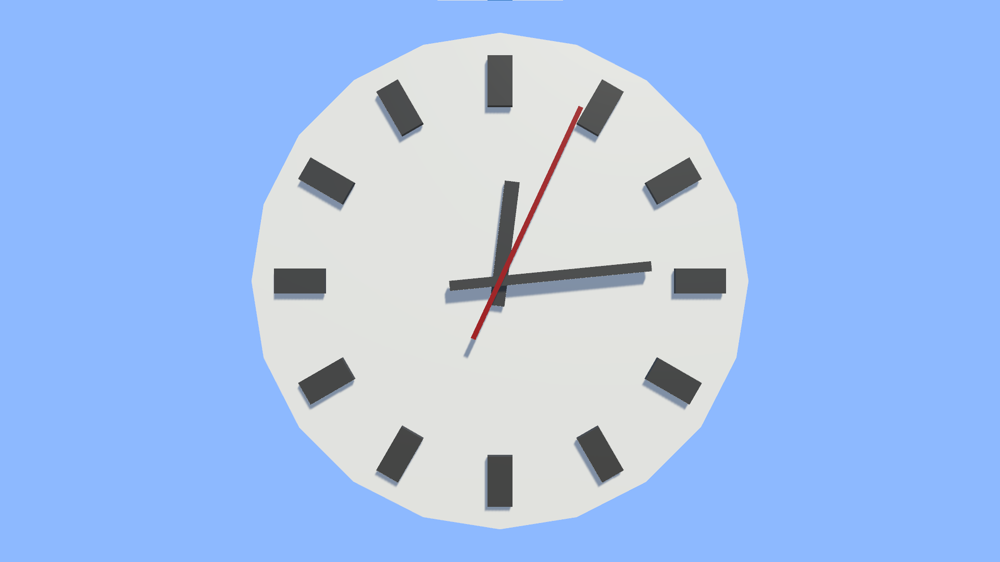

# Clock  

This project is a reproduction of ["Game Objects and Scripts Creating a Clock"](https://catlikecoding.com/unity/tutorials/basics/game-objects-and-scripts/)  
It shows a clock and tells you the current time.  

------

`Assets` folder contains all data for game  
`Build` folder contains built game for Windows x86_64 platform  
`Build_Android` folder contains built game for Android platform  

------

Engine Version: 2020.3.8f1

------

