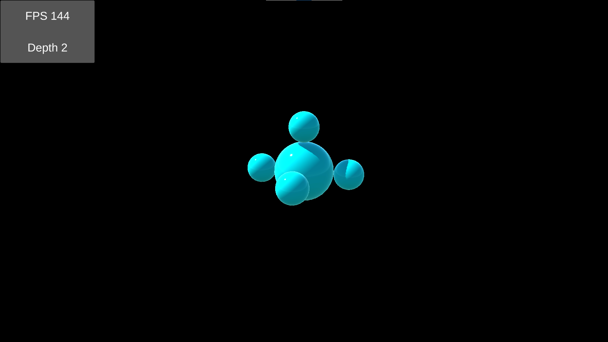
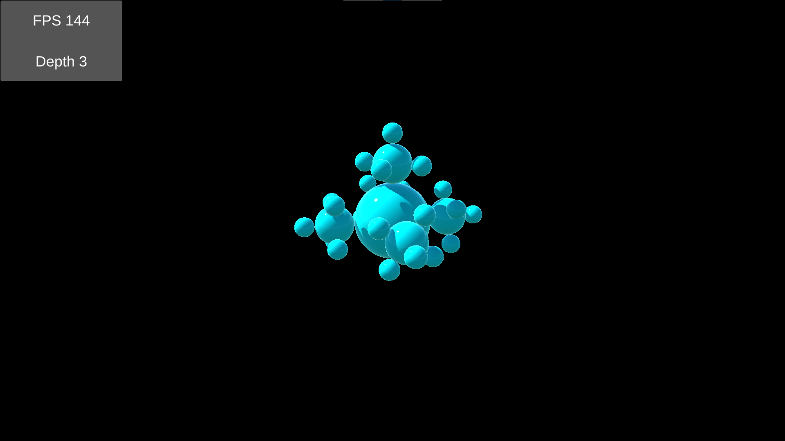
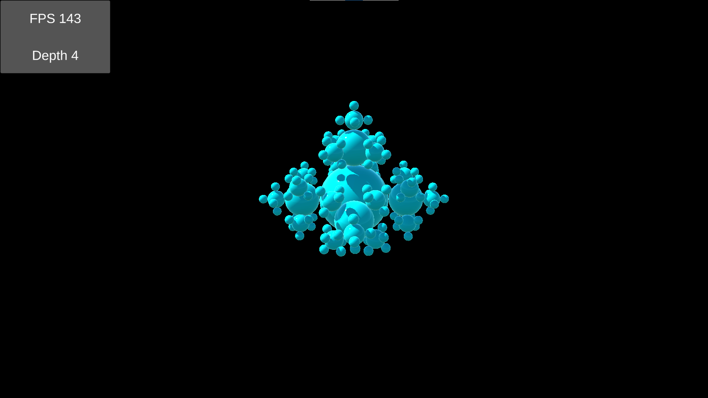
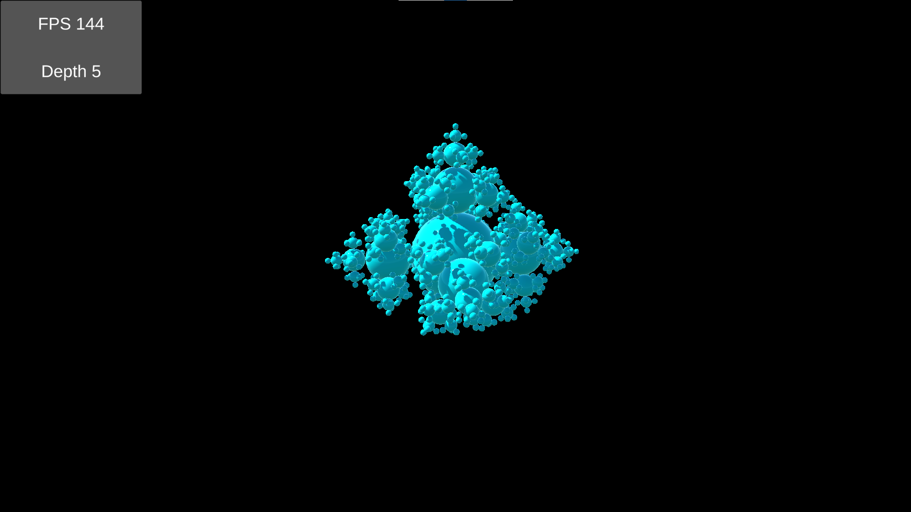
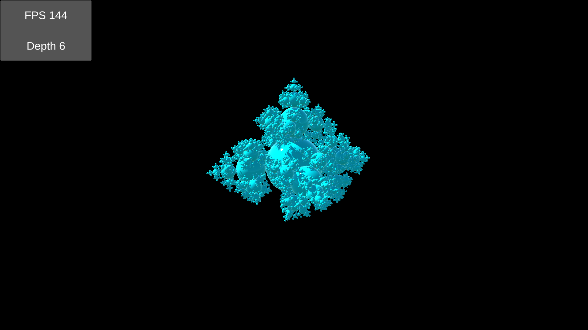
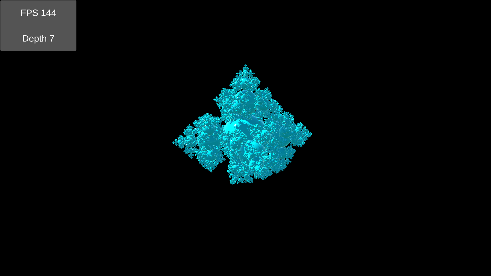
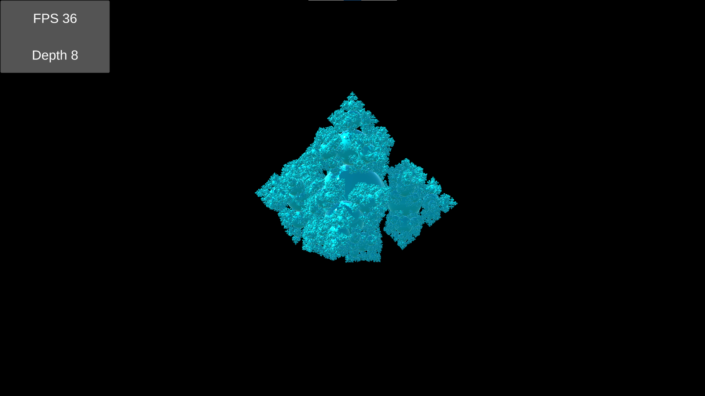

# Fractal  

This project is a reproduction of ["Jobs Animating a Fractal"](https://catlikecoding.com/unity/tutorials/basics/jobs/)  
It renders a fractal based on given depth, using procedural instanced rendering on URP.  
Optimized using Burst parallel job scheduler.  

------

`Assets` folder contains all data for game  
`Build` folder contains built game for Windows x86_64 platform  

------

Engine Version: 2020.3.8f1

------

  
  
  
  
  
  
  