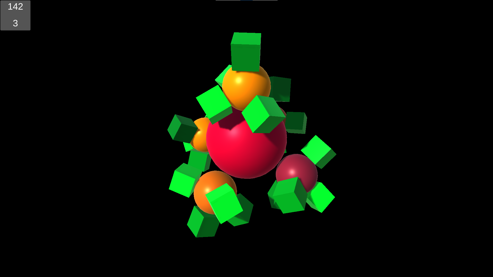
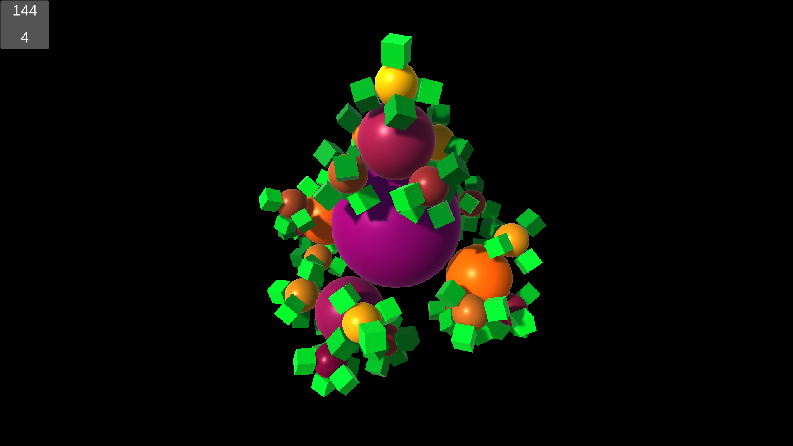
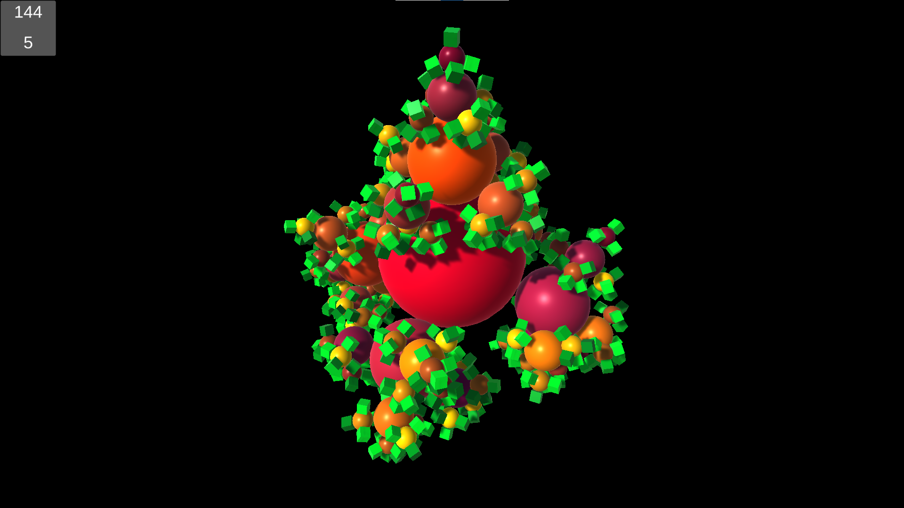
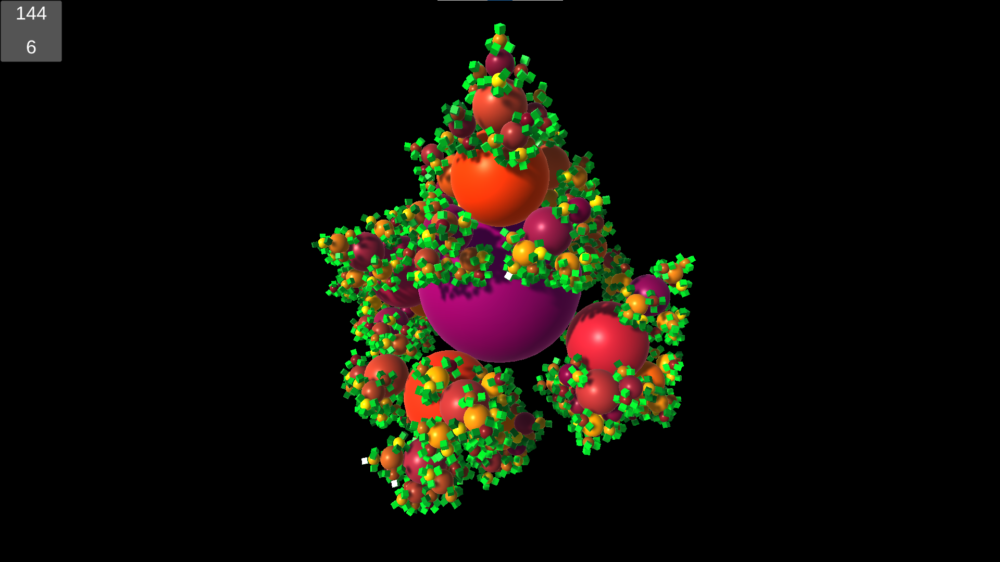
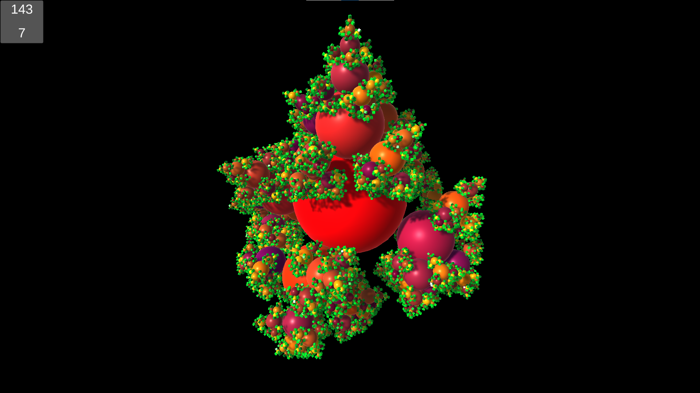
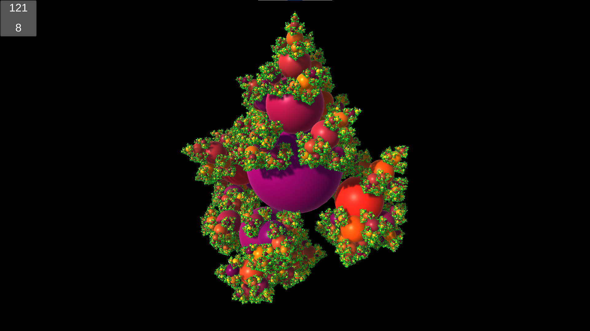
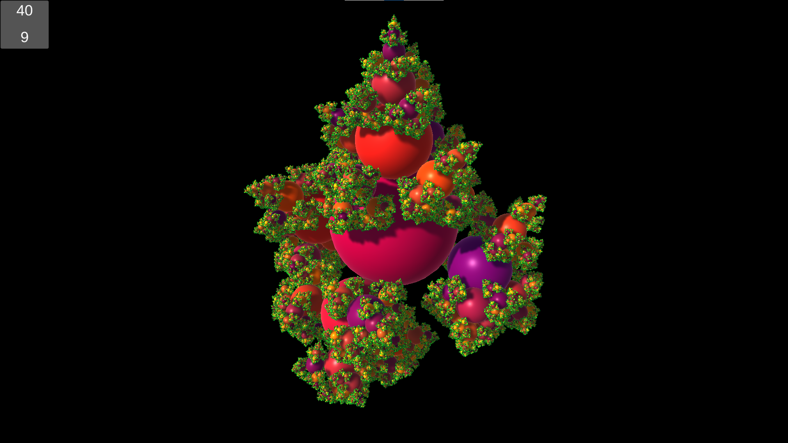

# Fractal Vibrant  

This project is a reproduction of ["Organic Variety Making the Artificial Look Natural"](https://catlikecoding.com/unity/tutorials/basics/organic-variety/)\
It renders a fractal with vibrant organic colors.\
Uses URP as rendering pipeline.

------

`Assets` folder contains all data for game

------

Engine Version: 2020.3.8f1

------

\
\
\
\
\
\

------

### Comparing Mono and IL2CPP
* Package built with IL2CPP is smaller than the one built with Mono, but not significantly.
* Performance is not affected because this game essentially uses GPU for computing, and Burst is also used for optimized CPU pararllel jobs.
* Building time for IL2CPP is significantly longer.
* Mono will carry many dotnet `dll`s.
* IL2CPP will produce the source `cpp` codes for the build as a backup, which you may not want to share. (they are huge)