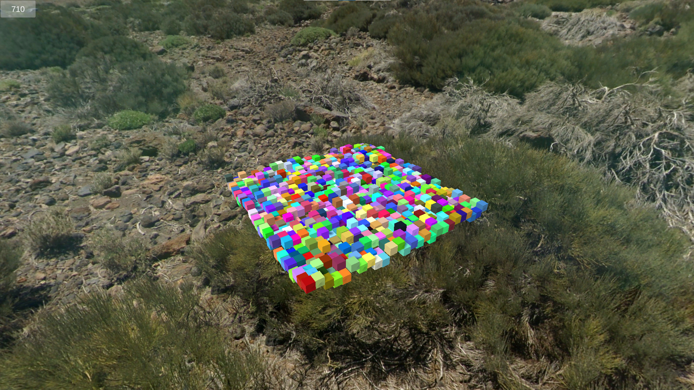

# Hashing  

This project is a reproduction of ["Hashing Small xxHash"](https://catlikecoding.com/unity/tutorials/pseudorandom-noise/hashing/)\
It visualizes pseudorandom noise by hashing.

------

`Assets` folder contains all data for game

------

Engine Version: 2020.3.8f1

------

\
\
\
