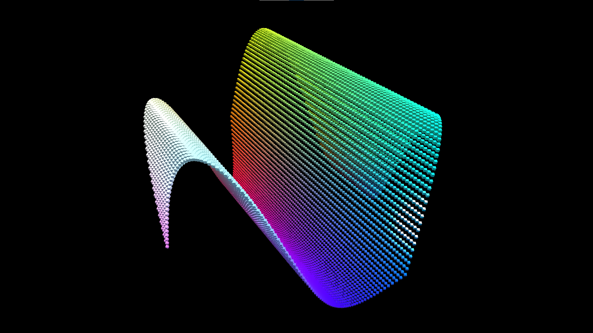
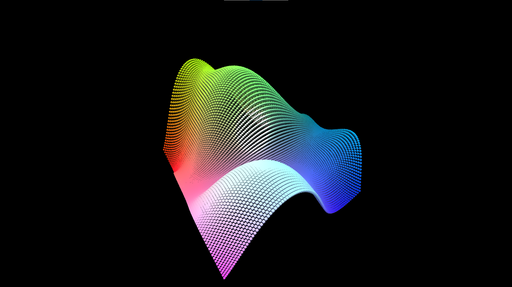
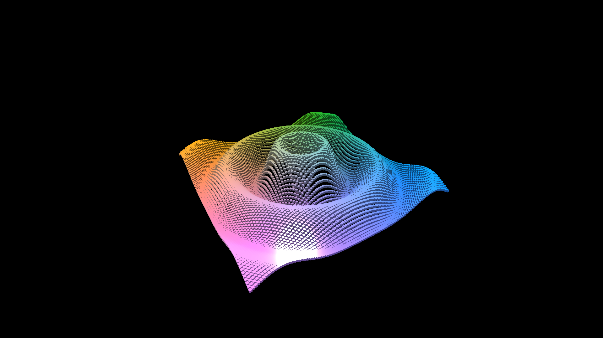
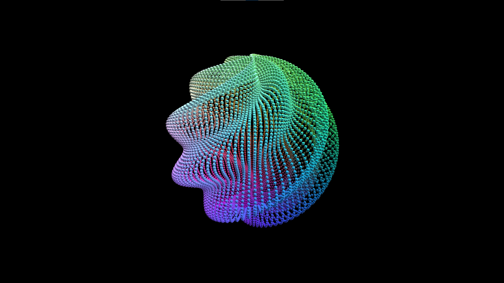
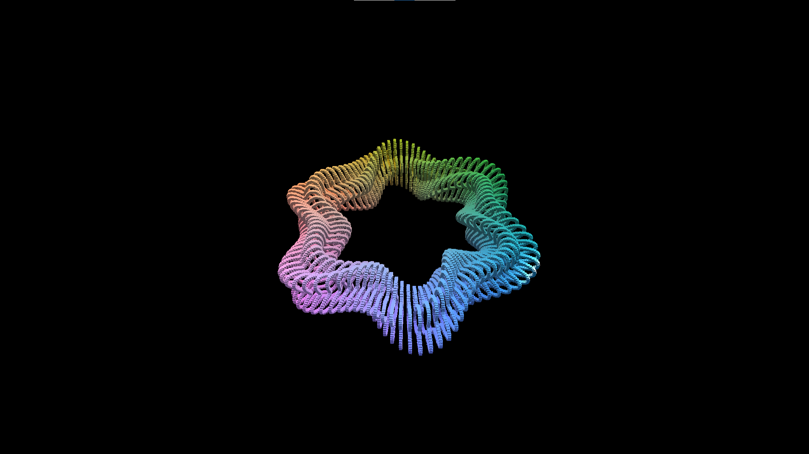

# Math Curves  

This project is a reproduction of ["Mathematical Surfaces Sculpting with Numbers"](https://catlikecoding.com/unity/tutorials/basics/mathematical-surfaces/)  
It visualizes parameterized surfaces.  

------

`Assets` folder contains all data for game  
`Build` folder contains built game for Windows x86_64 platform  

------

Engine Version: 2020.3.8f1

------

  
  
  
  
  