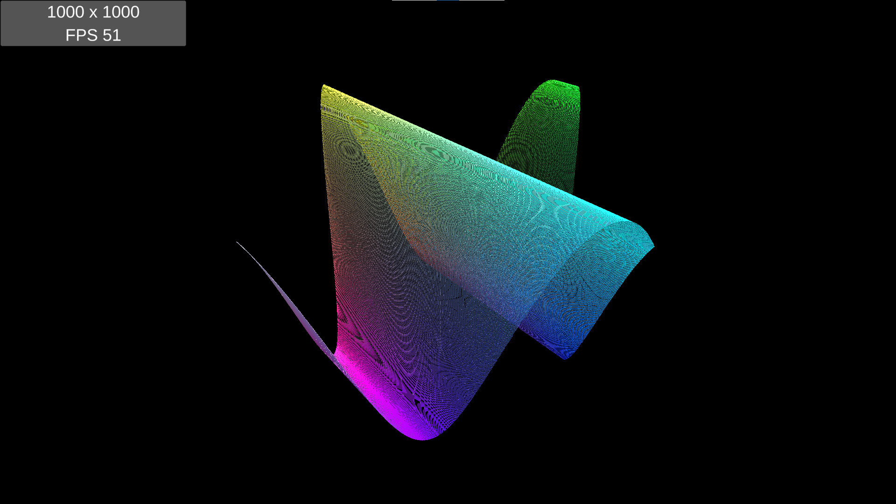
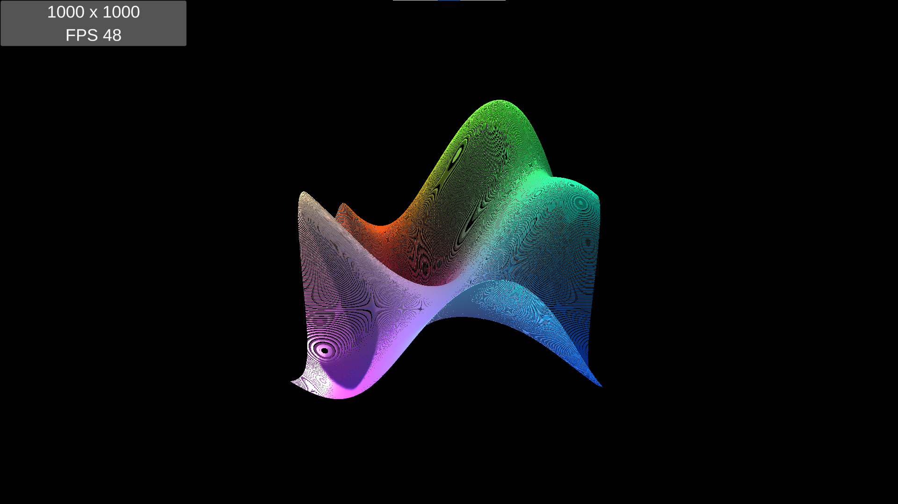
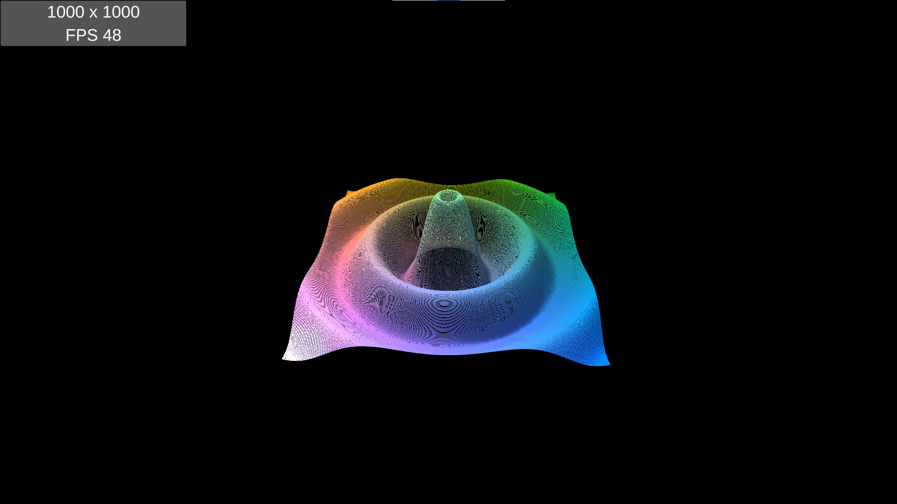
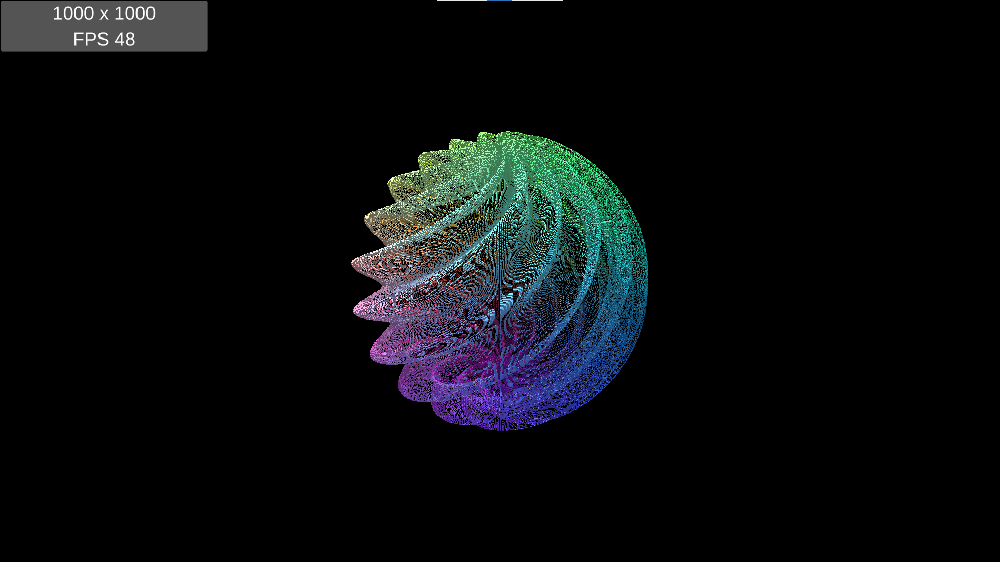
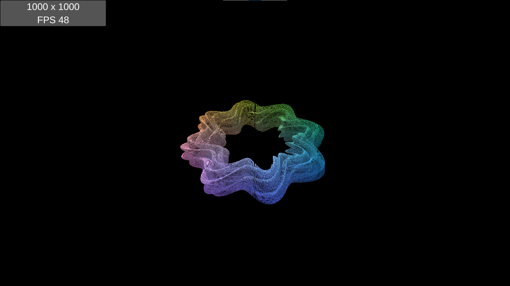

# Math Curves GPU  

This project is a reproduction of ["Compute Shaders Rendering One Million Cubes"](https://catlikecoding.com/unity/tutorials/basics/compute-shaders/)  
It visualizes parameterized surfaces using compute shaders.  

------

`Assets` folder contains all data for game  
`Build` folder contains built game for Windows x86_64 platform  
`Build_Android` folder contains built game for Android platform  

------

Engine Version: 2020.3.8f1

------

  
  
  
  
  