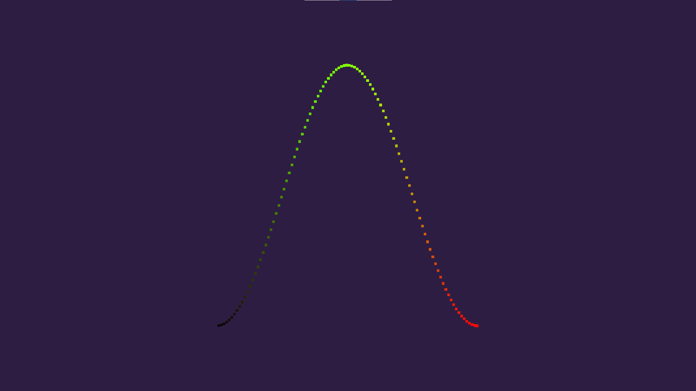

# Sine Curve  

This project is a reproduction of ["Building a Graph Visualizing Math"](https://catlikecoding.com/unity/tutorials/basics/building-a-graph/)  
It visualizes a sine curve by instantiating objects.  

------

`Assets` folder contains all data for game  
`Build` folder contains built game for Windows x86_64 platform  

------

Engine Version: 2020.3.8f1

------

